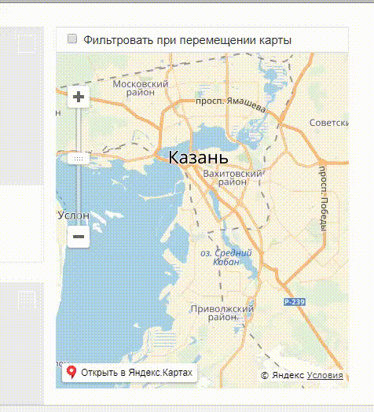

## install

npm i vue-fixed-block --save-dev

## use

```html
<fixed-block
  @changeFix="changeFix"
  :fix-delay="100">
  content
</fixed-block>
```
example app

```js
import FixedBlock from 'vue-fixed-block'
Vue.use(FixedBlock)
```

## screenshot



#### fixed-block properties
| Name   | Type  | Required | Default | Description |
| ------ |:-----:| :---------:| --------|:---------|
| fix-delay | Number | false | 2 | the offset of the scroll actuation attachment |

#### fixed-block events
| Name   | params | Type | Description |
| ------ |:-----:|:-----:|:---------|
| change-fix | fixed | Boolean | called when the block is attached or detached  |

## Event Bus

#### events
| Name   | params | Type | Description |
| ------ |:-----:|:-----:|:---------|
| change-fix | fixed | Boolean | called when the block is attached or detached |

**example events**
```js
import {Event} from 'vue-fixed-block'
Event.$on('change-fix', function (fixed) {
  // check 'fixed' param
})
```

##### Call up position recalculation
```js
Event.$emit('recalc')
```